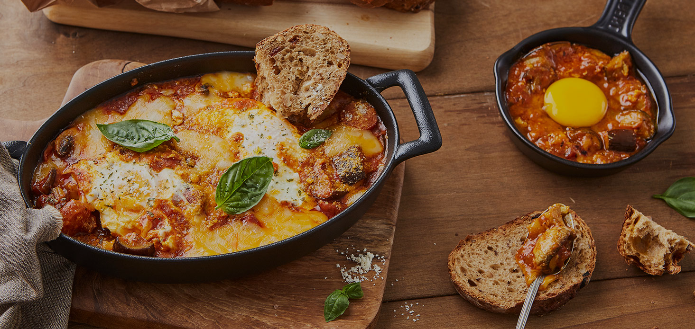
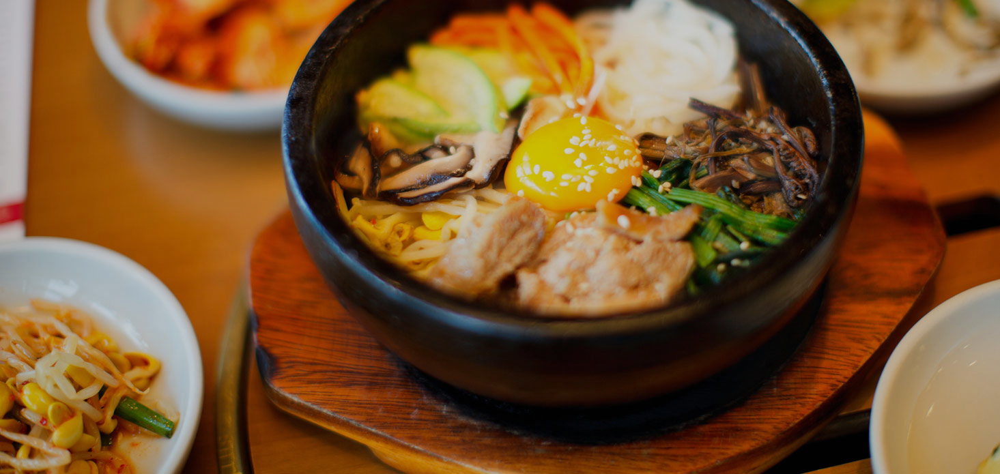

<div align="center">
<h1>Project_O'Kitchen 📖</h1>
이 프로젝트는 O'Kitchen을 리뉴얼 한 반응형 웹 사이트입니다.
</div>

<br>

<image width="100%" src="main.png"></image>

<br>
<br>

## 💡 Skills
<p>


</p>

> **JavaScript를 활용하여 반응형 웹 디자인과 모바일 내비게이션 기능을 제공합니다.**
> <br>
> **Google Maps API와 Swiper.js를 이용해 동적인 지도 표시와 슬라이더 효과 등을 구현하였습니다.**

<br>
<br>

## 🔖 주요 특징
### 1. Main : 
```c
<div id="main_slider">
  <div class="swiper-container">
    <div class="swiper-wrapper">
      <div class="swiper-slide">
        <div class="title">
          <span class="tag">#계란요리 #카레</span>
          <span class="tag">#맥주안주 #브런치 #치즈듬뿍</span>
          <strong>요리의 업그레이드<br>셰프의 팁</strong>
          <span class="tip">오뚜기 간편식이 요리가되는 팁!</span>
        </div>
        
      </div>
      <div class="swiper-slide">
        <div class="title">
          <span class="tag">#한식 #집밥 #비빔장</span>
          <span class="tag">#만능소스 #소불고기양념</span>
          <strong>온 가족과 함께<br>오늘은 오뚜기집밥</strong>
          <span class="tip">오뚜기 간편식이 요리가되는 팁!</span>
        </div>
        
      </div>
      <div class="swiper-slide">
        <div class="title">
          <span class="tag">#XO만두 #굴림만두</span>
          <span class="tag">#캠핑 #라망치즈 #셰프의팁</span>
          <strong>#인기레시피<br>캠핑 요리</strong>
          <span class="tip">오뚜기 간편식이 요리가되는 팁!</span>
        </div>
        
      </div>
      <div class="swiper-slide">
        <div class="title">
          <span class="tag">#김치 #장국</span>
          <span class="tag">#국수맛집 #분식집 #포장마차</span>
          <strong>#신규레시피<br>가볍게 소울 푸드</strong>
          <span class="tip">오뚜기 간편식이 요리가되는 팁!</span>
        </div>
        
      </div>
      <div class="swiper-slide">
        <div class="title">
          <span class="tag">#치즈듬뿍 #샐러드 #브런치</span>
          <strong>샐러드 토핑<br>오뚜기 스트링치즈!</strong>
          <span class="tip">오뚜기 간편식이 요리가되는 팁!</span>
        </div>
        
      </div>
    </div>
    <div class="swiper-button-next"></div>
    <div class="swiper-button-prev"></div>
    <div class="swiper-pagination"></div>
  </div>
</div>
```
```c
window.addEventListener("load", function(){
  const mainSwiper=new Swiper("#main_slider .swiper-container", {
    navigation: {
      prevEl: "#main_slider .swiper-button-prev",
      nextEl: "#main_slider .swiper-button-next"
    },
    pagination: {
      el: "#main_slider .swiper-pagination",
      type: "fraction"
    }
  });
});
```

<br>

> **swiperJS 라이브러리를 이용하여 동적인 이미지 슬라이더를 구현하였습니다.**

<br>
<br>

### 2. Google Maps API :
<image width="100%" src="Google Maps.png"></image>

```c
let map;

function initMap(){
	let myLatLng={lat: 37.390141551118695, lng: 126.97151846772532};

	let map=new google.maps.Map(document.getElementById("map"), {
		center: myLatLng,
		zoom: 16,
		mapTypeControl: false,
		zoomControl: false,
		fullscreenControl: false,
		rotateControl: false
	});

	let marker=new google.maps.Marker({
		position: myLatLng,
		map: map,
		title: "(주)오뚜기"
	});
}
```

<br>

> **Google Maps API를 활용한 지도 표시 및 마커를 추가하였습니다.**
